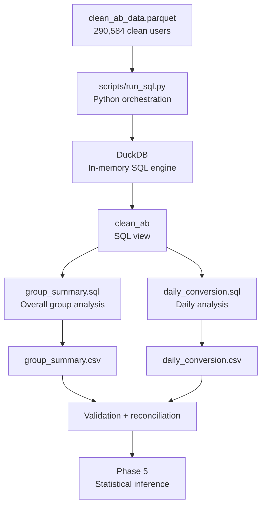
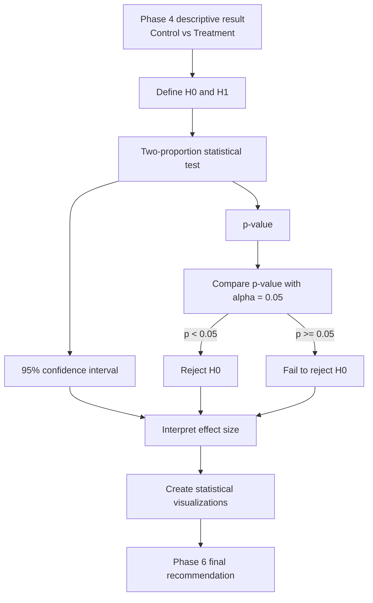

# Project Phases and Implementation Guide

## Project Goal

This project evaluates whether a **new landing page** changes the conversion rate compared with the **old landing page**.

Experiment design:

- `control` -> `old_page`
- `treatment` -> `new_page`
- `converted = 1` means the user converted
- `converted = 0` means the user did not convert
- Experimental unit: one user

This file is a living project record. It should be updated at the end of each phase.

---

## Project Roadmap

| Phase | Purpose | Main tools | Status |
|---|---|---|---|
| 1 | Build a reproducible project foundation | Git, GitHub, Python environment, Markdown | COMPLETE |
| 2 | Validate and clean the raw experiment data | Python, pandas, pyarrow | COMPLETE |
| 3 | Test the pipeline automatically | pytest, GitHub Actions | COMPLETE |
| 4 | Perform analytical queries | DuckDB, SQL, Python | COMPLETE |
| 5 | Perform statistical inference and visualization | R, stats, ggplot2 | COMPLETE |
| 6 | Interpret results and finalize the project | Markdown, Git, GitHub | NOT STARTED |

---

# Phase 1 - Reproducible Workspace Foundation

## Purpose

Create a clean, reproducible project before writing analysis code.

A reproducible project should allow another person to obtain the same raw dataset,
install the documented environment, run the documented commands, and recreate
the analysis.

## What was done

- Created the project folder structure.
- Created and activated a Python virtual environment.
- Recorded exact Python package versions in `requirements.txt`.
- Created `.gitignore`.
- Protected `.venv/` from Git.
- Protected `data/raw/ab_data.csv` from Git.
- Added `data/raw/README.md` to document the raw dataset source and location.
- Added `.gitkeep` files so important empty folders remain trackable.
- Created the main `README.md`.
- Initialized Git.
- Created the first meaningful commit.
- Created a public GitHub repository.
- Connected local `main` to `origin/main`.
- Pushed the foundation commit successfully.

## Foundation commit

```text
7c9ddc7 chore: initialize reproducible A/B test workspace
```

## Why this phase matters

It separates raw data, code, dependencies, processed data, outputs, tests, and documentation.
It also ensures the analysis does not depend on a personal absolute Windows path.

## Status

**COMPLETE**

---

# Phase 2 - Python Validation and Cleaning Pipeline

## Purpose

Transform the raw A/B experiment dataset into a clean, validated dataset using deterministic Python code.
The original raw CSV remains unchanged.

## Block 2A - Raw Data Inspection

Raw file: `data/raw/ab_data.csv`

File size: `15,901,933 bytes`

SHA-256:

```text
d56e2accec25e99ac21cb3d76c5df516dd19cc7a77c14c9014f94e1ea1301beb
```

Raw shape:

```text
Rows: 294,478
Columns: 5
```

Columns: `user_id`, `timestamp`, `group`, `landing_page`, `converted`.

Findings:

- Missing values: 0
- Unparseable timestamps: 0
- Unique users: 290,584
- Rows belonging to duplicated user IDs: 7,788
- Duplicated user IDs: 3,894

Valid experiment assignments:

```text
control   + old_page
treatment + new_page
```

Invalid experiment assignments:

```text
control   + new_page
treatment + old_page
```

Observed mismatches:

```text
control + new_page      1,928
treatment + old_page    1,965
Total mismatches        3,893
```

## Block 2B - Cleaning Contract

Cleaning order:

1. Validate required schema.
2. Validate missing values.
3. Validate allowed `group` values.
4. Validate allowed `landing_page` values.
5. Validate `converted` contains only `0` and `1`.
6. Parse and validate timestamps.
7. Remove assignment mismatches.
8. Inspect duplicate users after assignment cleaning.
9. Reject conflicting duplicate records.
10. For equivalent duplicates, keep the earliest valid observation.
11. Verify one row remains per user.
12. Verify no assignment mismatches remain.

After assignment cleaning:

```text
Raw rows:                   294,478
Assignment mismatches:        3,893
Rows after removal:         290,585
Unique users:               290,584
Extra observations:               1
```

Only user `773192` remained duplicated. Both rows agreed on group, landing page, and conversion; only timestamp differed. The deterministic rule is to keep the earliest valid observation.

## Block 2C - Core Python Cleaning Pipeline

Created: `src/pipeline.py`

Main responsibilities:

- `validate_schema()`
- `validate_raw_values()`
- `parse_timestamps()`
- `valid_assignment_mask()`
- `validate_duplicate_users()`
- `clean_ab_data()`

Real-data smoke-test result:

```text
raw_rows: 294,478
assignment_mismatches_removed: 3,893
duplicate_users_after_assignment_cleaning: 1
duplicate_rows_removed: 1
clean_rows: 290,584
unique_users: 290,584
control_rows: 145,274
treatment_rows: 145,310
```

Final invariants:

```text
Duplicate users remaining:       0
Assignment mismatches remaining: 0
```

Clean descriptive conversion rates:

```text
control
count       145,274
converted    17,489
rate       0.120386

treatment
count       145,310
converted    17,264
rate       0.118808
```

These are descriptive results only. Statistical inference is deferred to Phase 5.

## Block 2D - Command-Line Runner and Outputs

Created `scripts/run_pipeline.py`.

The runner can recreate the cleaned data from the raw dataset with one command.

It generates:

- `data/processed/clean_ab_data.csv`
- `data/processed/clean_ab_data.parquet`

Both outputs were validated with:

- 290,584 rows
- 290,584 unique users
- 0 duplicate users
- 0 assignment mismatches
- 145,274 control users
- 145,310 treatment users

## Block 2E - Reproducibility Check

The generated CSV and Parquet files were hashed, deleted, regenerated from the
same raw dataset, and hashed again.

Results:

- PASS: CSV reproduced identically.
- PASS: Parquet reproduced identically.

### SHA-256

SHA-256 acts like a digital fingerprint for a file.

It was used to:

1. identify the exact raw dataset used for this project;
2. verify that the same input, code, and environment reproduce the same output.

The raw dataset SHA-256 is:

d56e2accec25e99ac21cb3d76c5df516dd19cc7a77c14c9014f94e1ea1301beb

Different input data should normally produce a different output hash.

### Reusable Pipeline

The cleaning pipeline can also process another dataset if it follows the same
A/B-test data contract.

It expects:

- `user_id`
- `timestamp`
- `group`
- `landing_page`
- `converted`

For compatible data it will apply the same rules:

1. validate the schema and values;
2. validate timestamps;
3. remove control/new-page and treatment/old-page mismatches;
4. validate duplicate users;
5. keep the earliest equivalent duplicate;
6. reject conflicting duplicate records;
7. verify final invariants;
8. write clean CSV and Parquet outputs.

This means the project contains reusable cleaning logic rather than manual CSV editing.

## Phase 2 Completion Summary

294,478 raw observations  
- 3,893 assignment mismatches  
- 1 equivalent duplicate observation  
= 290,584 clean observations  
= 290,584 unique users

Commit:

`34a7a00 feat: add reproducible A/B data cleaning pipeline`

## Status

**COMPLETE**

---

# Phase 3 - Pipeline Tests and Continuous Integration

## Purpose

Verify automatically that the pipeline behaves correctly and continues to do so after future code changes.

Planned tools: pytest and GitHub Actions.

Planned checks include valid input, schema failures, invalid values, malformed timestamps, assignment mismatches, equivalent duplicates, conflicting duplicates, and final uniqueness.

## Status

**COMPLETE**

---

# Phase 4 - DuckDB Analytical Queries

## Purpose

Transform the validated cleaned experiment data into reproducible analytical summaries using DuckDB and SQL.

The question changes from:

> Is the data clean and reliable?

to:

> What does the cleaned experiment actually show?

Phase 4 is descriptive analysis. Statistical inference is deliberately deferred to Phase 5.

## Core Phase 4 Flow



A simpler version of the same flow is:

```text
Clean Parquet data
       |
       v
Python runner
       |
       v
DuckDB engine
       |
       v
SQL queries
       |
       v
Analytical summaries
       |
       v
Validation
       |
       v
Phase 5 statistical inference
```

## What Each Technology Does

### Parquet

`clean_ab_data.parquet` stores the cleaned typed dataset efficiently.

### Python

`scripts/run_sql.py` orchestrates the workflow. It knows where the data, SQL files, and output files are located.

### DuckDB

DuckDB is the analytical execution engine. It performs operations such as COUNT, SUM, AVG, GROUP BY, ORDER BY, and date conversion.

### SQL

SQL expresses the analytical questions independently from Python orchestration.

### CSV outputs

The generated CSV files preserve small analytical results that can be reviewed and reused by later phases.

## Why DuckDB

A traditional database can require a permanent server, database configuration, credentials, networking, and table loading.

DuckDB is embedded directly in the Python process:

```python
duckdb.connect(database=":memory:")
```

The temporary in-memory database exists only while the analytical script runs.

The project therefore gets full SQL analytical capabilities without maintaining a separate database server.

## Parquet to SQL View

The runner reads:

```text
data/processed/clean_ab_data.parquet
```

and exposes the dataset to DuckDB SQL with the logical name:

```text
clean_ab
```

The SQL queries can therefore use:

```sql
FROM clean_ab
```

This separates responsibilities: Python manages physical file paths, while SQL describes the analysis.

## Analytical Grain

The grain of a dataset describes what one row represents.

For this cleaned experiment:

```text
1 row = 1 unique experiment user
```

This is why `COUNT(*)` correctly represents the number of users.

Phase 4 verifies the assumption again:

```text
Input rows:   290,584
Unique users: 290,584
```

If these values differ, the analysis stops rather than producing potentially misleading statistics.

## SQL Metric Logic

The overall group query calculates:

```sql
SELECT
    "group",
    COUNT(*) AS users,
    CAST(SUM(converted) AS BIGINT) AS conversions,
    AVG(converted) AS conversion_rate
FROM clean_ab
GROUP BY "group"
ORDER BY "group";
```

### COUNT(*)

Counts rows. Because one row equals one user, this is the number of users.

### SUM(converted)

`converted` is binary:

```text
0 = did not convert
1 = converted
```

Adding the column therefore counts conversions.

### AVG(converted)

The average of a 0/1 variable equals the proportion of observations equal to 1.

Therefore:

```text
AVG(converted)
=
conversions / users
=
conversion rate
```

### GROUP BY

`GROUP BY "group"` makes DuckDB calculate the metrics separately for control and treatment.

## Daily Analysis

The daily query uses:

```sql
CAST(timestamp AS DATE)
```

to convert a timestamp such as:

```text
2017-01-05 13:42:51
```

into:

```text
2017-01-05
```

The experiment contains 23 calendar dates and both experiment arms on every date:

```text
23 days x 2 groups = 46 daily summary rows
```

## Why the Runner Validates Again

Phase 2 already validated the cleaned dataset, but every major analytical stage should protect the assumptions it depends on.

Phase 4 therefore checks three types of correctness.

### Data correctness

```text
Rows = unique users
290,584 = 290,584
```

### Analytical correctness

```text
COUNT(*)       -> users
SUM(converted) -> conversions
AVG(converted) -> conversion rate
```

### Reconciliation correctness

```text
145,274 control users
+
145,310 treatment users
=
290,584 total users
```

The daily summaries must also reconcile back to all 290,584 users.

This detects accidental loss or double counting during aggregation.

## Actual Descriptive Results

| Group | Users | Conversions | Conversion rate |
|---|---:|---:|---:|
| Control | 145,274 | 17,489 | 12.0386% |
| Treatment | 145,310 | 17,264 | 11.8808% |

Total conversions: **34,753**.

Observed treatment-minus-control difference:

```text
11.8808% - 12.0386%
= approximately -0.1578 percentage points
```

Descriptively, the new-page treatment group converted slightly less often than the old-page control group in this sample.

This is not yet evidence that the treatment is statistically worse.

Phase 5 determines whether the observed difference is statistically supported or could reasonably result from random variation.

## Reproducible Runner

The complete SQL analysis is reproduced with:

```powershell
python scripts/run_sql.py
```

The runner automatically:

1. finds the clean Parquet input;
2. opens in-memory DuckDB;
3. creates the `clean_ab` view;
4. verifies input uniqueness;
5. loads the SQL files;
6. executes both analytical queries;
7. validates the result schemas and totals;
8. writes the two CSV outputs;
9. closes the temporary database.

## Generated Outputs

- `outputs/group_summary.csv`
- `outputs/daily_conversion.csv`

These are small analytical result artifacts and are suitable to keep in Git for review, while the much larger processed datasets remain reproducible generated files excluded from Git.

## How to Explain Phase 4 to the Teacher

> Phase 4 takes the validated Parquet dataset and uses DuckDB as an embedded SQL analytical engine. Python orchestrates the process, while SQL defines the analytical calculations. Because the cleaned dataset has one row per user, COUNT represents users, SUM of the binary converted field counts conversions, and AVG calculates the conversion rate. The analysis produces overall and daily summaries, and all aggregated counts are reconciled back to the 290,584 cleaned users. The observed treatment rate is slightly lower than control, but Phase 4 is descriptive; statistical significance is evaluated separately in Phase 5.

## Phase 4 Completion Gate

Phase 4 reproducibility gate passed.

Final GitHub Actions verification:

```text
Run ID: 33521469773
Result: SUCCESS
All workflow steps passed on the fresh Ubuntu runner.
```

- DuckDB analysis completed successfully.
- Group and daily summaries reconciled to all 290,584 cleaned users.
- The experiment covered 23 dates and produced 46 date-by-group rows.
- The analytical CSV outputs were regenerated from the same clean Parquet input.
- SHA-256 comparisons confirmed both outputs reproduced identically.
- The existing pytest regression suite remained healthy with 13 tests passing.

## Status

**COMPLETE**

# Phase 5 - R Statistical Analysis

## Purpose

Determine whether the small conversion-rate difference observed in Phase 4 is statistically supported or could reasonably result from random experiment variation.

Phase 4 answered:

> What difference did we observe in this sample?

Phase 5 asks:

> Is that observed difference strong enough relative to normal sampling variation to provide evidence of a real population difference?

Observed Phase 4 result:

```text
Control conversion rate:   12.0386%
Treatment conversion rate: 11.8808%

Treatment - Control:
approximately -0.1578 percentage points
```

This descriptive difference alone is not sufficient for a statistical conclusion.

## Core Phase 5 Flow



A simpler verbal flow is:

```text
Observed difference
       |
       v
H0 and H1
       |
       v
Two-proportion test
       |
       +-------------------+
       |                   |
       v                   v
    p-value        confidence interval
       |                   |
       +---------+---------+
                 |
                 v
        compare p-value to 0.05
                 |
         +-------+-------+
         |               |
         v               v
     reject H0      fail to reject H0
                 |
                 v
        interpret effect size
                 |
                 v
             Phase 6
```

## Null Hypothesis - H0

```text
H0: p_treatment = p_control
```

The null hypothesis represents the baseline assumption that there is no real population-level difference in conversion rate between the new and old landing pages.

The analysis tests whether the observed data provide enough evidence against this baseline.

## Alternative Hypothesis - H1

```text
H1: p_treatment != p_control
```

The alternative hypothesis states that the population conversion rates differ.

Because the alternative allows either a positive or negative difference, this project uses a two-sided test.

The question is therefore whether the new page is different, not only whether it is better.

## Significance Level

The project uses:

```text
alpha = 0.05
```

The decision rule is:

```text
p-value < 0.05
-> reject H0

p-value >= 0.05
-> fail to reject H0
```

Failing to reject H0 does not prove that H0 is true. It means the experiment does not provide sufficient statistical evidence against H0 at the chosen significance level.

## What the p-value Means

The p-value is interpreted under the assumption that H0 is true.

It asks:

> If the pages really had equal population conversion rates, how unusual would it be to observe a sample difference at least as extreme as the one measured in this experiment?

Conceptually:

```text
Assume no real difference
        |
        v
Repeat the experiment conceptually
        |
        v
Random samples produce different rates
        |
        v
How often is the difference this extreme?
        |
        v
p-value
```

A small p-value means the observed result would be unusual if H0 were true.

A larger p-value means the observed result is reasonably compatible with random variation under H0.

## Confidence Interval

The confidence interval complements the p-value by estimating a range of plausible treatment-minus-control effects.

The effect is defined as:

```text
treatment conversion rate - control conversion rate
```

Interpretation:

```text
negative effect -> treatment lower
zero            -> no difference
positive effect -> treatment higher
```

If a 95% confidence interval contains zero, then a zero population difference remains compatible with the data at the corresponding two-sided 5% significance level.

## Why a Two-Proportion Test

The experiment outcome is binary:

```text
converted = 1
not converted = 0
```

There are two independent experiment arms:

```text
control
treatment
```

The quantities being compared are therefore two conversion proportions:

```text
17,489 / 145,274
versus
17,264 / 145,310
```

A two-sample proportion test is appropriate for comparing these two rates.

The planned R implementation uses:

```r
prop.test(..., correct = FALSE)
```

## Statistical Significance vs Practical Significance

These are different questions.

```text
Statistical significance
-> Is the difference unlikely to be explained by random sampling variation?

Practical significance
-> Is the difference large enough to matter in a real decision?
```

A very large sample can make a very small effect statistically significant.

Therefore Phase 5 evaluates statistical evidence, while Phase 6 combines statistical significance, effect size, and practical meaning into the final recommendation.

## Actual Phase 5 Statistical Result

The R analysis produced the following observed values:

| Metric | Result |
|---|---:|
| Control conversion rate | 12.0386% |
| Treatment conversion rate | 11.8808% |
| Treatment - Control | -0.1578 percentage points |
| Two-sided p-value | 0.189883 |
| 95% CI lower bound | -0.3938 percentage points |
| 95% CI upper bound | +0.0781 percentage points |
| Alpha | 0.05 |
| Decision | Fail to reject H0 |

The p-value is larger than the significance threshold:

```text
0.189883 > 0.05
```

Therefore the null hypothesis is not rejected.

The correct interpretation is:

> The experiment does not provide sufficient statistical evidence at the 5% significance level that the population conversion rates of the control and treatment landing pages differ.

This does not prove that the two pages are exactly equal.

The 95% confidence interval for Treatment - Control is approximately:

```text
-0.3938 percentage points
to
+0.0781 percentage points
```

Because the interval contains zero, a zero population difference remains compatible with the observed data.

The observed sample difference is negative, meaning the treatment conversion rate was slightly lower, but the statistical evidence is not strong enough to conclude that this reflects a real population effect.

## Direction Consistency

The effect direction is defined consistently throughout the project as:

```text
Treatment - Control
```

Therefore:

```text
negative -> treatment lower
zero     -> no difference
positive -> treatment higher
```

The same ordering is used in Phase 4 descriptive calculations, the R effect calculation, the `prop.test()` input order, the confidence interval, and the final interpretation.

This prevents accidentally reversing the sign of the experiment effect.

## Independent Cross-Check

The R result was independently verified using the equivalent two-proportion z-test equations in Python.

The independent calculation reproduced the same:

- treatment-minus-control difference;
- z statistic;
- two-sided p-value;
- 95% confidence interval.

This provides an additional verification that the statistical result is not dependent on one implementation alone.

## Generated Phase 5 Outputs

- `outputs/statistical_test.csv`
- `outputs/figures/conversion_rates.png`
- `outputs/figures/daily_conversion.png`

The first figure compares the overall conversion rates of the two experiment groups.

The second figure shows how conversion rates changed by day for control and treatment.


## Planned Phase 5 Outputs

Phase 5 will produce:

- the observed treatment-minus-control difference;
- a two-proportion hypothesis test;
- a p-value;
- a 95% confidence interval;
- a reject-or-fail-to-reject decision for H0;
- effect-size interpretation;
- reproducible statistical figures;
- R-generated result artifacts for Phase 6.

## Current Environment Gate

The initial Phase 5 check found that `Rscript` was unavailable from PowerShell.

Investigation showed that R 4.6.1 was already installed at:

```text
C:\Program Files\R\R-4.6.1\bin\x64\Rscript.exe
```

The issue was that the R executable directory was not available on the current PowerShell PATH.

After adding the R bin directory to the session PATH, `Rscript --version` succeeded and the required `readr`, `dplyr`, and `ggplot2` packages were installed and verified.

## How to Explain Phase 5 to the Teacher

> Phase 4 showed the observed conversion rates, but an observed difference can occur simply because of random sampling variation. Phase 5 therefore performs statistical inference. The null hypothesis assumes the two population conversion rates are equal, while the two-sided alternative says they differ. A two-proportion test calculates a p-value and confidence interval. The p-value is compared with alpha = 0.05 to decide whether there is sufficient evidence to reject the null hypothesis. The confidence interval shows the plausible size and direction of the effect. Statistical significance is kept separate from practical significance, which is considered in the final recommendation.

## Phase 5 Completion Gate

Phase 5 reproducibility gate passed.

Evidence:

- R 4.6.1 command-line execution was verified.
- `readr`, `dplyr`, and `ggplot2` were installed and verified.
- Exact R/package versions were recorded in `r/package-versions.txt`.
- The R two-proportion analysis completed successfully.
- The observed Treatment - Control difference was -0.157824 percentage points.
- The two-sided p-value was 0.1898833745.
- The 95% confidence interval was approximately [-0.393786, +0.078138] percentage points.
- The statistical decision was Fail to reject H0.
- An independent Python implementation reproduced the same p-value and confidence interval.
- `statistical_test.csv` reproduced with an identical SHA-256 hash.
- Both PNG figures reproduced with identical SHA-256 hashes.
- The existing Python regression suite remained healthy with 13 tests passing.

Therefore Phase 5 is considered reproducible and complete.

## Status

**COMPLETE**

# Phase 6 - Final Interpretation and Documentation

## Purpose

Combine all technical outputs into a clear final answer to the project question.

The final interpretation will distinguish between descriptive difference, statistical significance, and practical significance.
The README and this document will be updated with final results and exact reproduction commands.

## Status

**NOT STARTED**

---

# Reproducibility Goal

At completion, another person should be able to:

1. Clone the repository.
2. Obtain the documented raw dataset.
3. Place it at `data/raw/ab_data.csv`.
4. Create the Python virtual environment.
5. Install `requirements.txt`.
6. Run the cleaning pipeline.
7. Run automated tests.
8. Run DuckDB analysis.
9. Run the R statistical analysis.
10. Recreate the tables, figures, and final conclusion.

---

# Commit Roadmap

```text
Commit 1 - Workspace and reproducibility foundation        COMPLETE
Commit 2 - Python validation and cleaning pipeline         COMPLETE
Commit 3 - Pipeline tests and GitHub Actions               COMPLETE
Commit 4 - DuckDB analytical queries                       COMPLETE
Commit 5 - R analysis, figures, and statistical test       COMPLETE
Commit 6 - Final report documentation and results          NOT STARTED
```

---

# Current Position

```text
Phase 1  Reproducible Foundation          COMPLETE
Phase 2  Python Data Pipeline             COMPLETE
Phase 3  Tests + Continuous Integration   COMPLETE
Phase 4  DuckDB + SQL                     COMPLETE
Phase 5  R Statistical Analysis           COMPLETE
Phase 6  Final Interpretation             NOT STARTED
```

Next step: **Phase 6 - final interpretation, practical significance, and project conclusion.**


---

## Phase 3 Progress - Automated Testing and CI

### Block 3A - Local Unit Tests

Created:

- `tests/test_pipeline.py`
- `pytest.ini`

The test suite uses small synthetic pandas DataFrames instead of the full Kaggle dataset.
This keeps tests fast, isolated, understandable, and runnable on GitHub.

The tests verify:

- valid data passes
- missing required columns fail
- unexpected columns fail
- missing required values fail
- invalid group values fail
- invalid landing-page values fail
- invalid conversion values fail
- malformed timestamps fail
- assignment mismatches are removed
- equivalent duplicates keep the earliest observation
- conflicting duplicate conversions fail
- a user cannot silently appear in both valid experiment arms
- final cleaned data has one row per user

Local result: **13 passed.**

This provides regression protection: future changes to the cleaning pipeline can be checked automatically against these expected behaviors.

### Block 3B - GitHub Actions Continuous Integration

Created:

- `.github/workflows/tests.yml`

The workflow runs on pushes and pull requests.

GitHub Actions will:

1. create a fresh Ubuntu runner
2. check out the repository
3. install Python 3.14
4. install `requirements.txt`
5. run `python -m pytest -q`

This checks that the project and its tests work outside the development laptop.

GitHub Actions run 33494180229 completed successfully on a fresh Ubuntu runner. After the workflow actions were updated, final verification run 33501111954 also completed successfully. All CI steps passed.

### How GitHub Actions Ran the Tests on Cloud Ubuntu

GitHub Actions is the Continuous Integration (CI) system used by this project.

The workflow contains:

```yaml
runs-on: ubuntu-latest
``

This instruction tells GitHub to automatically create a temporary Ubuntu Linux machine in the cloud.

The CI process is:

1. a commit is pushed to GitHub;
2. GitHub detects the workflow in `.github/workflows/tests.yml`;
3. GitHub creates a fresh Ubuntu runner;
4. `actions/checkout` downloads the repository onto that runner;
5. `actions/setup-python` prepares Python 3.14;
6. dependencies are installed from `requirements.txt`;
7. GitHub runs `python -m pytest -q`;
8. the 13 pipeline tests are executed;
9. GitHub reports success or failure;
10. the temporary Ubuntu machine is discarded after the job.

This is different from manually opening Ubuntu. GitHub automatically creates and manages the Linux environment.

Why this matters:

The tests already passed on the local Windows development machine. They also passed on a newly created Linux environment that did not contain the developer's personal configuration.

Therefore Phase 3 provides stronger evidence of portability and reproducibility:

```text
Windows development machine -> tests pass
Fresh Ubuntu CI machine     -> tests pass
``

The fresh runner also reduces the risk of hidden dependencies, such as software or configuration that exists only on the developer's computer.
